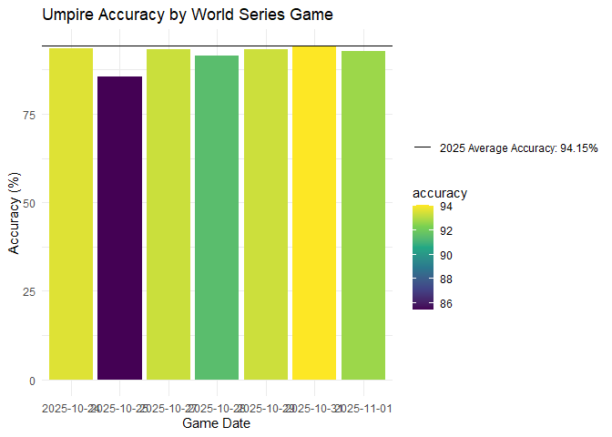
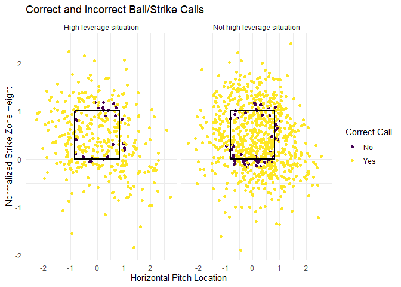
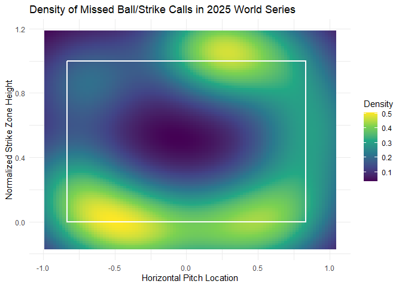
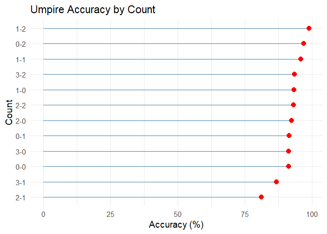

# Untitled


``` r
library(tidyverse)
```

    Warning: package 'purrr' was built under R version 4.5.3

    Warning: package 'dplyr' was built under R version 4.5.3

    ── Attaching core tidyverse packages ──────────────────────── tidyverse 2.0.0 ──
    ✔ dplyr     1.2.1     ✔ readr     2.2.0
    ✔ forcats   1.0.1     ✔ stringr   1.6.0
    ✔ ggplot2   4.0.2     ✔ tibble    3.3.1
    ✔ lubridate 1.9.5     ✔ tidyr     1.3.2
    ✔ purrr     1.2.2     
    ── Conflicts ────────────────────────────────────────── tidyverse_conflicts() ──
    ✖ dplyr::filter() masks stats::filter()
    ✖ dplyr::lag()    masks stats::lag()
    ℹ Use the conflicted package (<http://conflicted.r-lib.org/>) to force all conflicts to become errors

``` r
library(readxl)
library(plotly)
```


    Attaching package: 'plotly'

    The following object is masked from 'package:ggplot2':

        last_plot

    The following object is masked from 'package:stats':

        filter

    The following object is masked from 'package:graphics':

        layout

# Overview

This project analyzes MLB umpire accuracy on called balls and strikes
during the 2025 World Series using Statcast data from Baseball Savant.
The goal is to evaluate how accurate umpires are in high-stakes
situations and identify where missed calls are most likely to occur.

## Research Question

How accurate are MLB umpires in the biggest moments?

Specifically, this project examines:

- Overall umpire accuracy  
- Accuracy by game  
- Accuracy by pitch count  
- Missed call locations  
- Differences between high-leverage and non-high-leverage situations

## Data

The dataset contains pitch-level Statcast data from the 2025 World
Series.

``` r
data <- read_excel(here::here("data/2025WS_data.xlsx"))
```

Key variables used in this analysis include:

- `plate_x` and `plate_z`: pitch location  
- `sz_top` and `sz_bot`: batter-specific strike zone boundaries  
- `balls` and `strikes`: count  
- `inning`, `home_score`, and `away_score`: game situation  
- `des`: umpire call description  
- `abs_call`,`ump_call`,`correct_call`: Created variables

The data was filtered to only include taken pitches that were called
either a ball or a called strike. I then created a simplified automated
strike zone based on pitch location. A pitch was classified as a strike
if it crossed within the horizontal strike zone and fell between the
batter’s individual strike zone height.

``` r
data$plate_x <- as.numeric(data$plate_x)
data$plate_z <- as.numeric(data$plate_z)

clean_data <- data %>%
  filter(description %in% c("ball", "called_strike")) %>%
  mutate(
    ump_call = if_else(description == "called_strike", "Strike", "Ball"),
    abs_call = if_else(
      plate_x >= -0.83 & plate_x <= 0.83 &
        plate_z >= sz_bot & plate_z <= sz_top,
      "Strike",
      "Ball"
    ),
    correct_call = if_else(ump_call == abs_call, "Yes", "No"),
    z_norm = (plate_z - sz_bot) / (sz_top - sz_bot),
    count = paste(balls, strikes, sep = "-"),
    two_strike = ifelse(strikes == 2, "Two strikes", "Fewer than two strikes"),
    full_count = ifelse(balls == 3 & strikes == 2, "Yes", "No"),
    late_inning = ifelse(inning >= 7, "Yes", "No"),
    run_diff = abs(home_score - away_score),
    close_game = ifelse(run_diff <= 3, "Yes", "No"),
    high_lev = ifelse(
      late_inning == "Yes" & close_game == "Yes",
      "High leverage situation",
      "Not high leverage situation"
    )
  )
```

For this project, a high-leverage situation was defined as a pitch in
the 7th inning or later with a run differential of 3 or fewer runs. This
is a simplified definition, but it helps compare normal situations to
moments where missed calls may feel more important.

## Visualizations and Results

### Accuracy by Game

``` r
accuracy_data <- clean_data %>%
  group_by(game_date) %>%
  count(correct_call) %>%
  mutate(
    game_date = as.character(game_date),
    accuracy = (n / sum(n)) * 100
  ) %>%
  filter(correct_call == "Yes")

ggplot(
  accuracy_data,
  aes(x = game_date, y = accuracy, fill = accuracy, label = round(accuracy, 2))
) +
  geom_col() +
  theme_minimal() +
  scale_fill_viridis_c() +
  geom_hline(
    aes(yintercept = 94.15, linetype = "2025 Average Accuracy: 94.15%")
  ) +
  labs(
    title = "Umpire Accuracy by World Series Game",
    x = "Game Date",
    y = "Accuracy (%)",
    linetype = ""
  )
```



Umpire accuracy across World Series games remains consistently high and
close to the MLB average of 94.15%. We can see that game 2 had a
significant drop in accuracy, but the other 6 games were relatively
consistent. This suggests that World Series umpires perform at a level
similar to the regular-season average, but sometimes can see a drop.

### Pitch Location: Correct vs. Incorrect Calls

``` r
ggplot(clean_data, aes(x = plate_x, y = z_norm, color = correct_call)) +
  geom_point(position = "jitter") +
  geom_rect(
    xmin = -0.83, xmax = 0.83,
    ymin = 0, ymax = 1,
    fill = NA, color = "black", linewidth = 1
  ) +
  theme_minimal() +
  scale_color_viridis_d() +
  labs(
    title = "Correct and Incorrect Ball/Strike Calls",
    x = "Horizontal Pitch Location",
    y = "Normalized Strike Zone Height",
    color = "Correct Call"
  ) +
  facet_wrap(~high_lev)
```



This plot shows where umpires made correct and incorrect calls. Most
incorrect calls occur near the edges of the strike zone. Pitches clearly
inside or outside the zone are usually called correctly, while
borderline pitches are more prone to error. The high-leverage and
non-high-leverage plots show similar patterns.

### Missed Call Density

``` r
missed_calls <- clean_data %>%
  filter(correct_call == "No")

ggplot(missed_calls, aes(x = plate_x, y = z_norm)) +
  stat_density_2d(
    aes(fill = after_stat(density)),
    geom = "raster",
    contour = FALSE
  ) +
  geom_rect(
    xmin = -0.83, xmax = 0.83,
    ymin = 0, ymax = 1,
    fill = NA, color = "white", linewidth = 1
  ) +
  scale_fill_viridis_c() +
  theme_minimal() +
  labs(
    title = "Density of Missed Ball/Strike Calls in 2025 World Series",
    x = "Horizontal Pitch Location",
    y = "Normalized Strike Zone Height",
    fill = "Density"
  )
```



The heatmap highlights where missed calls occurred most often. The
highest density of missed calls appears near the top, bottom, and
corners of the strike zone. This supports the idea that missed calls are
not random. Instead, they happen in areas where the call is most
difficult.

### Accuracy by Count

``` r
accuracy_by_count <- clean_data %>%
  group_by(count) %>%
  summarise(
    total_pitches = n(),
    correct_calls = sum(correct_call == "Yes"),
    accuracy = (correct_calls / total_pitches)*100
  )
ggplot(accuracy_by_count, aes(x = reorder(count, accuracy), y = accuracy, label = accuracy)) +
  geom_segment(aes(xend = count, y = 0, yend = accuracy), color = "steelblue") +
  geom_point(color = "red", size = 3) +
  coord_flip() +
  theme_minimal(base_size = 14) + 
  labs(
    title = "Umpire Accuracy by Count",
    x = "Count",
    y = "Accuracy (%)"
  ) 
```



Accuracy remains relatively consistent across pitch counts, but we do
see a drop when the count is “hitter-friendly”. This could suggest
umpires expand the zone slightly when the count is in favor of the
hitter. An observation worth noting is the accuracy on 2 strike counts.
The accuracy is very high in 2 strike counts, suggesting that umpires
are more focused and less likely to make an error when the batter is on
the verge of striking out.

## Key Findings

- Umpire accuracy in the 2025 World Series was generally high.  
- Most missed calls occurred near the edges of the strike zone.  
- High-leverage situations did not appear to create a major drop in
  accuracy.  
- Accuracy changed depending on the count, specifically 2 strike counts,
  and “hitter-friendly” counts

## Limitations

- This is an approximation of ABS, not official ABS data.
- Strike zone height for visuals is normalized because hitters vary in
  size.
- One World Series is a small sample.
- This project does not fully simulate how game outcomes would change.
- Future work could include full-season data or run expectancy.

## Conclusion

This project found that MLB umpire accuracy in the 2025 World Series was
generally strong, but missed calls occurred in specific areas of the
strike zone. The main pattern was that missed calls clustered near the
edges of the zone, especially around the top, bottom, and corners. The
count also influenced accuracy. We can see that 2 strike counts were
very high in accuracy while “hitter-friendly” counts such as 3-0 and 3-1
were much lower. This suggests that umpires may expand their zone when
the count is in the hitters favor while keeping the zone the same when
there are 2 strikes.
